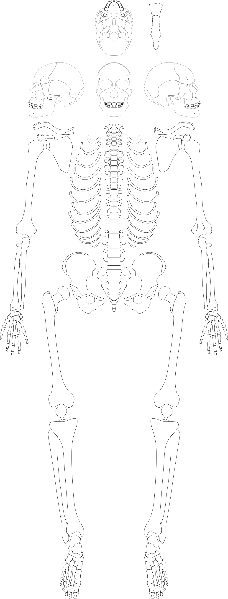

# Bones — Installation and User Guide (Windows & Linux)

**Bones** is a desktop application designed for the graphic documentation of skeletal remains from archaeological excavations.  
With it, you can outline preserved bone elements, annotate fragments, generate basic statistics, and export results in CSV or PDF format.  

This guide provides step-by-step instructions for Windows and linux users and can be easily followed regardless of prior experience.

---

## Acknowledgements

This software was created within the scope of the NCN (National Science Centre, Poland) grant:  
**Muslim women in Fatimid Alexandria: Why did they die young? Biocultural factors in the change of living conditions for people buried at Kom el-Dikka in Mediaeval Alexandria compared to the rural Christian population on the fringes of Fayoum.**

More information is available here: https://pcma.uw.edu.pl/en/2023/08/11/project-muslim-women-in-fatimid-alexandria/


Important
- Windows/linux: This project currently supports Windows/linux. macOS is not supported. Linux is not covered in this guide.
  
## 1) Bones - Install Guide

Install from GitHub Releases
1. Go to this repository’s GitHub page, then open the Releases section.
2. Download the installer for your system:
   - Windows: bones-0.5.2-win-x64.rar
   - Linux (Debian/Ubuntu): bones_0.5.2_amd64.deb
   - Linux (Fedora/RHEL/openSUSE): bones-0.5.2-1.x86_64.rpm

Windows install
- The Windows download is a .rar file:
  1. Extract it using 7-Zip or WinRAR.
  2. Inside the extracted folder, run Bones-0.5.2 Setup.exe.
  3. Follow the on-screen installer steps.
  4. On first launch, Windows Defender Firewall may ask for permission. Allow it so the app can run.

Linux install (Debian/Ubuntu)
- Option A: Double-click the .deb in your file manager and install via your software installer, or
- Option B: Use a terminal:
  ```
  sudo dpkg -i bones_0.5.2_amd64.deb
  sudo apt-get -f install
  ```
  The second command fixes missing dependencies if any.

Linux install (Fedora/RHEL/openSUSE)
- Option A: Double-click the .rpm in your file manager and install via your software installer, or
- Option B: Use a terminal:
  ```
  sudo rpm -i bones-0.5.2-1.x86_64.rpm
  ```
  If dependencies are required, your software center will guide you.

Launch the app
- Windows: Use the desktop shortcut or find Bones in the Start menu.
- Linux: Find Bones in your applications menu. If needed, search for “Bones”.


## 2) Get the skeleton SVG (background)

<!-- Inline preview -->
  


You will need a skeleton SVG file to use as a background.

Note: When you download the SVG, it will first open in your browser (as an image).  
To save it correctly on your computer:
-  Right-click on the image
-  Choose **“Save As…”**
-  Save it as `skeleton.svg` on your computer

Click below to open and download:
<a href="https://raw.githubusercontent.com/osteoalex/bones/main/assets/szkielet_base_plain_no_markings_ids.svg" download="skeleton.svg">⬇️ Download the SVG</a>

 ---

- SVG requirements (important)
  - Each bone outline must be a closed path.
  - Each closed path must have a unique id equal to the bone name. If you have multiple views of the same bone, add a prefix/suffix to make ids unique.
  - Non-closed paths are treated as auxiliary information only.
  - No groups/layers: keep the SVG flat (single layer).

## 3) First run — Create or open a collection

When the app opens, you have two choices:

A. Create a new collection (start from scratch)
1. Click “Create New Collection”.
2. Enter a name and a description.
3. Click Save. You will be asked to choose where to save it (select your preferred folder).
4. Continue to “Add a background” below.

B. Open an existing collection
1. Click “Open Existing Collection”.


## 4) Add a background (your SVG)

1. Inside your collection, click “Add Background”.
2. Select the skeleton SVG file you downloaded earlier.
3. The app will convert it and add it to your collection’s backgrounds folder
4. You’ll see a success message when it’s done.

Now your collection has a valid background and you can start adding items and layers.


## 5) Add your first item

1. Click “Add New Item”.
2. Provide a name (e.g., Skull_01) and confirm (Create).
3. The app creates a .json file for this item inside your collection’s items folder 
4. You can now work on this item with layers and fragments.


## 6) Work with layers and fragments

Create a layer
1. In the layer controls, click “Add Layer”.
2. Give the layer a name.
3. Choose a fill color and a stroke color.
4. Choose a stroke width (default is 2).
5. Click Save. You can create as many layers as you need.

Add and edit fragments
- Select with Rectangle: quickly select elements inside a rectangular area.
- Draw Fragment to Add: add new fragments to your selected layer.
- Draw Fragment to Subtract: remove parts of a fragment (carve away).
- Draw Line to Split: split a fragment by drawing a line across it.
- Move to Layer: move selected fragments to another layer.
- Layer Visibility: show/hide layers to focus on specific parts.
- Hover/Info: see helpful info by hovering over elements.

Save your work
- Save Item: saves the current item’s state (all layers, fragments, and styles).
- Save and Close Item: saves and closes the current item.

What gets saved
- When you save, the app writes your item’s data to a JSON file (.json). 

## 7) Export your work (optional)

- Export Collection (CSV)
  - Export each item’s layers as CSV files with geometry and properties for analysis 
  - You specify the output folder; the app creates per-layer CSV files.

- Export SVG (full)
  - Export a combined SVG of the background plus your selected fragments.

- Export Bone SVG (focused)
  - Export a focused SVG of specific bone fragments you choose.


## 8) Navigation and tips

- Zoom: Hold Shift, press and hold the left mouse button (LMB), and move the mouse to zoom.
- Window: You can maximize the app window for a larger workspace.
- ESC: In many contexts, Esc acts as a back/close shortcut inside collection pages.


## 9) Troubleshooting

Windows
- The .rar won’t open:
  - Install 7-Zip or WinRAR and extract bones-0.5.2-win-x64.rar first.
- SmartScreen warning:
  - Click “More info” then “Run anyway” if you trust the app’s source (this repository).
- The app doesn’t start:
  - Try reinstalling. If prompted by Windows Defender Firewall, click Allow.

Linux (Debian/Ubuntu)
- If dpkg reports dependency issues:
  ```
  sudo apt-get -f install
  ```

Linux (RPM-based)
- If rpm reports missing dependencies:
  - Use your software center to install dependencies, or consult your distribution’s package manager documentation.

General
- If you don’t see your background:
  - Re-check the SVG rules (closed paths, unique ids, no groups). Re-add the background.


---

## Bones — Run and Build Locally on Windows

## Contents
- Requirements
- Quick Start (Development)
- Build (Local Packages and Installers)
- Command Reference
- Tips for VS Code Terminal (Windows)
- Troubleshooting
- Data Background (SVG) Requirements
- Usage Tips
- FAQ
- License

## Requirements

- Node.js >= 20.9.0 and npm >= 10.1.0 (enforced by [engines](bones/package.json:21))
- Git
- Recommended: Visual Studio Code

Verify versions:
```
node -v
npm -v
```

If your versions are lower than required, upgrade Node/npm before continuing.


## Quick Start (Development)

1) Clone the repository and enter the app folder:
```
git clone <repo-url>
cd <repo-folder>
cd bones
```

2) Install dependencies (disable Git hooks during fresh installs):
- Windows Command Prompt (cmd):
```
set HUSKY=0 && npm ci
```
- Windows PowerShell:
```
$env:HUSKY=0; npm ci
```

3) Start the app in development (hot reload):
```
npm run start
```

What happens:
- Electron Forge launches with Webpack via the start script in [bones/package.json](bones/package.json:7).
- The app window opens and DevTools will open automatically in development mode.


## Build (Local Packages and Installers)

Create a local, runnable app bundle:
```
npm run package
```

Output:
- Windows: out/Bones-win32-x64/bones.exe
  - The executable name is configured as bones in [bones/forge.config.ts](bones/forge.config.ts:15).

Create platform installers (optional):
```
npm run make
```
- Installers are generated under out/make using makers defined in [bones/forge.config.ts](bones/forge.config.ts:18).


## Command Reference

- Development
  - Install (cmd): set HUSKY=0 && npm ci
  - Install (PowerShell): $env:HUSKY=0; npm ci
  - Start: npm run start

- Build
  - Package: npm run package
  - Make installers: npm run make


## Tips for VS Code Terminal (Windows)

- Use the correct shell with the correct syntax:
  - Command Prompt (cmd): set HUSKY=0 && npm ci
  - PowerShell: $env:HUSKY=0; npm ci

- Switch the default shell in VS Code:
  - View > Command Palette
  - Terminal: Select Default Profile
  - Choose Command Prompt or PowerShell


## Troubleshooting

- The app doesn’t start or Electron window doesn’t appear
  - Confirm you are inside the bones directory:
    - Run: dir (you should see package.json and forge.config.ts)
  - Confirm versions meet [engines](bones/package.json:21):
    - node -v, npm -v

- Clean reinstall (fixes most dependency issues)
  - Command Prompt (cmd):
    ```
    rmdir /s /q node_modules
    del package-lock.json
    set HUSKY=0 && npm ci
    ```
  - PowerShell:
    ```
    Remove-Item -Recurse -Force node_modules
    Remove-Item package-lock.json
    $env:HUSKY=0; npm ci
    ```

- Corporate proxy/SSL issues during install
  - Configure npm if installs hang:
    ```
    npm config set strict-ssl false
    npm config set proxy http://your-proxy:port
    npm config set https-proxy http://your-proxy:port
    ```


## Data Background (SVG) Requirements

To display and work with an SVG background correctly, ensure:
- The outline of each bone is a closed path.
- Each closed path has a unique id equal to the bone name; for multiple views of the same bone, add a view-specific prefix or suffix.
- Non-closed paths are treated as auxiliary information; they are not used for surface calculation.
- No layers or groups: there should be a single layer (flat structure).

These requirements reflect the original constraints described by the project and are essential for correct analysis and exports.


## Usage Tips

- Zooming:
  - Hold Shift and press the left mouse button (LMB), then move the mouse to zoom.


## FAQ

- Do I need an .env file?
  - No. The app reads name and version directly from [bones/package.json](bones/package.json:1) as seen in [bones/src/index.ts](bones/src/index.ts:17). The example file [bones/.env.example](bones/.env.example:1) is optional.

- Where is the built executable on Windows?
  - After npm run package:
    - out/Bones-win32-x64/bones.exe
    - The executable name is set in [bones/forge.config.ts](bones/forge.config.ts:15).

- Which script actually launches development?
  - npm run start calls Electron Forge as defined in [bones/package.json](bones/package.json:7).


## License

MIT License (see [bones/package.json](bones/package.json:25)).
