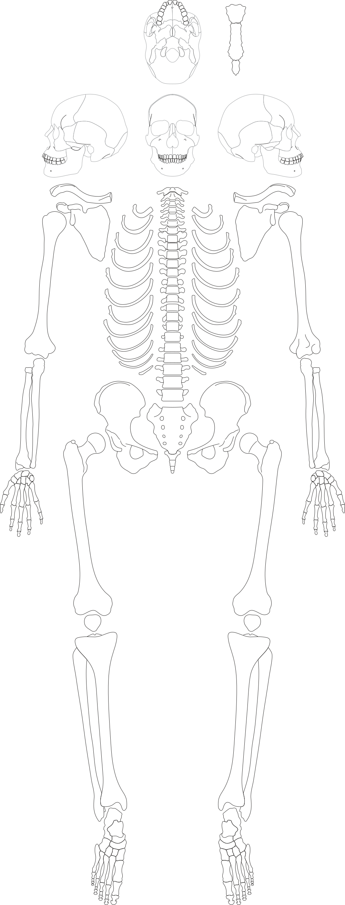
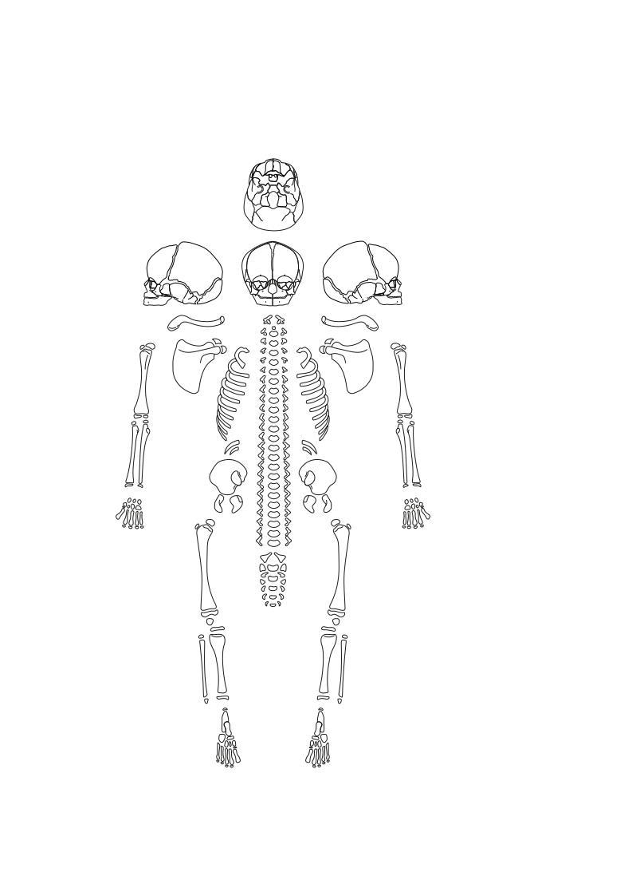

# Bones — Installation and User Guide (Windows & Linux)

**Bones** is a desktop application that is designed for the graphic documentation of skeletal remains from archaeological excavations.  
It can be used to outline preserved bone elements, annotate fragments, generate basic statistics, and export results in CSV or PDF format.  

This guide gives step-by-step instructions for Windows and linux users and is easy to follow no matter what your experience is.

---

## Acknowledgements

This software was created as part of of the NCN (National Science Centre, Poland) grant:  
**Muslim women in Fatimid Alexandria: Why did they die young? Biocultural factors in the change of living conditions for people buried at Kom el-Dikka in Mediaeval Alexandria compared to the rural Christian population on the fringes of Fayoum.**

You can find more information here:
https://pcma.uw.edu.pl/en/2023/08/11/project-muslim-women-in-fatimid-alexandria/
https://osteoalex.pcma.uw.edu.pl/faw/

Important
– Windows/linux: This project currently works with Windows/linux. macOS is not yet supported.
  
## 1) Bones – Install Guide

Install it from GitHub Releases
1. Go to the repository's GitHub page and open the Releases section.
2. Download the installer for your system:
   – Windows: bones-0.5.2-win-x64.rar
   – Linux (Debian/Ubuntu): bones_0.5.2_amd64.deb
   – Linux (Fedora/RHEL/openSUSE): bones-0.5.2-1.x86_64.rpm

Windows install
– The Windows download is a .rar file:
  1. Use 7-Zip or WinRAR to extract it.
  2. Inside the extracted folder, run Bones-0.5.2 Setup.exe.
  3. Follow the on-screen installer steps.
  4. When you first launch it, Windows Defender Firewall might ask for permission. Allow it so the app can run.

To install Linux (Debian/Ubuntu)
– Option A: Double-click the .deb in your file manager and install using your software installer, or
– Option B: Use a terminal:
  ```
  sudo dpkg -i bones_0.5.2_amd64.deb
  sudo apt-get -f install
  ```
  The second command will sort out any missing dependencies.

Installing Linux (Fedora/RHEL/openSUSE)
– Option A: Double-click the .rpm in your file manager and install using your software installer, or
– Option B: Use a terminal:
  ```
  sudo rpm -i bones-0.5.2-1.x86_64.rpm
  ```
  If dependencies are required, your software centre will guide you.

Launch the app
– Windows: Use the desktop shortcut or find Bones in the Start menu.
– Linux: Find Bones in the applications menu. If you need to find it, search for 'Bones'.


## 2) Get the skeleton SVG (background)

<!-- Inline preview -->
  


You will need to get the skeleton SVG file to use as a background.

Note: When you download the SVG, it will first open in your browser (as an image).  
To save it correctly on your computer:
–  Right-click on the image
– Select **"Save As…"**
-  Save it as `skeleton.svg` on your computer

Click on the link below to open and download:
<a href="https://raw.githubusercontent.com/osteoalex/bones/main/assets/skeleton.svg" download="skeleton.svg">Download the SVG</a>

---

### Get the Infant Skeleton SVG (background)

<!-- Inline preview -->
  

Click on the link below to open and download:
<a href="https://raw.githubusercontent.com/osteoalex/bones/main/assets/infant.svg" download="infant.svg">Download Infant Skeleton SVG</a>
         
 ---

– SVG requirements (important)
  – Each bone outline must be a closed path.
  – Each closed path must have a unique id that matches the bone name. If you have multiple views of the same bone, just add a prefix or suffix to make the ids unique.
  – Non-closed paths are treated as auxiliary information only.
  – Do not use groups/layers: keep the SVG flat (single layer).

## 3) First run — Create or open a collection

When the app opens, you have two choices:

A. Create a new collection (start from scratch)
1. Click on 'Create New Collection'.
2. Type in a name and a description.
3. Click Save. You will be asked to choose where to save it (select your preferred folder).
4. Continue to 'Add a background' below.

B. Open an existing collection
1. Click on 'Open Existing Collection'.


## 4) Add a background (your SVG)

1. Inside your collection, click on 'Add Background'.
2. Select the skeleton SVG file you downloaded earlier.
3. The app will convert it and add it to background folder for your collection.
4. You'll see a success message when it's done.

Now your collection has a valid background and you can start adding items and layers.


## 5) Add your first item

1. Click on 'Add New Item' or use the keyboard shortcut **Ctrl+N**.
2. Give it a name (e.g., Skull_01) and confirm (Create).
3. The app creates a .json file for this item inside your collection's items folder 
4. You can now work on this item with layers and fragments.


## 6) Work with layers and fragments

Create a layer
1. In the layer controls, click on 'Add Layer'.
2. Give the layer a name.
3. Choose a fill colour and a stroke colour.
4. Choose a stroke width (the default is 2).
5. Click Save. You can create as many layers as you need.

### Editing Tools

The toolbar provides the following tools for working with fragments:

| Tool | Description |
|------|-------------|
| **Select with Rectangle** | Quickly select multiple bone elements inside a rectangular area. Click to set the top-left corner, move the mouse, and click again to set the bottom-right corner. All bones fully inside the rectangle will be added to the current layer. |
| **Draw Fragment to Add** | Draw a custom outline to add fragments. Use points to draw the outline and double-click to finish drawing. The fragment will be added to the active layer. |
| **Draw Fragment to Subtract** | Remove parts of existing fragments by drawing an outline. Use points to draw the area to remove and double-click to finish. |
| **Draw Line to Split** | Split a fragment by drawing a line across it. Use points to draw the line and double-click to finish. The fragment will be divided along the line. |
| **Delete Fragment** | Click on any fragment to delete it from the current layer. |
| **Add Whole** | Click on bones to select or deselect them for adding entire bone elements. After selection, click the checkmark to add selected bones or X to cancel. Supports multi-select with Ctrl+Click and range select with Shift+Click. |
| **Save as SVG** | Export the current item as an SVG file. |
| **Get Info** | Click on any bone or fragment to display detailed information about it, including area calculations and properties. |
| **Add Annotation** | Add point annotations with text comments to specific locations on fragments. | 

### Layer Management

– **Layer Visibility**: Show or hide layers using the eye icon to focus on specific parts.
– **Edit Layer**: Modify layer name, colors, and stroke width.
– **Delete Layer**: Remove a layer (at least one layer must remain).
– **Layer Details**: View all fragments in a data grid with editable properties and color pickers.
– **Combine Layers**: Merge multiple layers into one. Overlapping fragments will be automatically combined.
– **Move to Layer**: Move selected fragments from one layer to another.

### Bones List

The Bones tab provides a searchable list of all bone elements:
– **Search**: Filter bones by name (minimum 3 characters).
– **Single Click**: Select a single bone for adding.
– **Ctrl+Click**: Toggle selection to add or remove bones from multi-selection.
– **Shift+Click**: Select a range of bones from the last selected to the clicked bone.

### Fragment Properties

When viewing fragment info, you can:
– Edit custom properties defined in the layer configuration.
– Change fill and stroke colors individually for each fragment.
– Adjust stroke width.
– View the fragment's area as a percentage of the total bone area.
– Export the specific bone fragment as SVG.
– Move the fragment to a different layer.
– Delete the fragment.

### Annotations

Add text annotations to mark specific points on your documentation:
1. Select the 'Add Annotation' tool.
2. Click on the location where you want to add an annotation.
3. Enter your annotation text in the dialog.
4. Annotations are saved with the item and can be edited or deleted later.

Save your work
– **Save Item** (Ctrl+S): Saves the current item (all layers, fragments, annotations, and styles).
– **Save and Close Item**: Saves and closes the current item.

What gets saved
– When you save, the app writes your item's data to a JSON file (.json). 

## 7) Keyboard Shortcuts

### Start Screen Shortcuts
| Shortcut | Action |
|----------|--------|
| **Ctrl+N** | Create a new collection |
| **Ctrl+O** | Open an existing collection |

### Collection Editor Shortcuts
| Shortcut | Action |
|----------|--------|
| **Ctrl+N** | Create a new item (within a collection) |
| **Ctrl+S** | Save the current item |
| **Ctrl+Click** | Toggle bone selection (multi-select) in Bones list |
| **Shift+Click** | Range select bones in Bones list |
| **ESC** | Abort current drawing operation or cancel selection |
| **Shift + Left Mouse Button + Move** | Zoom in/out/rotation of skeleton |

## 8) Export your work

– **Export Collection (CSV)**
  – Export each item's layers as CSV files with geometry and properties for analysis.
  – You specify the output folder; the app will create a CSV file for each layer.
  – Includes fragment geometry, target bone geometry, and all custom properties.

– **Export SVG (full)**
  – Export a combined SVG of the background and all visible fragments.
  – Preserves colors, styles, and layer information.

– **Export Bone SVG (focused)**
  – Export a focused SVG of a specific bone fragment you select.
  – Useful for detailed documentation of individual elements.


## 9) Navigation and tips

– **Zoom**: Hold Shift, press and hold the left mouse button (LMB), and move the mouse to zoom.
– **Drag Rotate and Zoom**: The editor supports drag rotation and zoom for enhanced navigation.
– **Window**: You can maximize the app window to get more workspace.
– **ESC**: In many contexts, Esc acts as a back/close shortcut inside collection pages and aborts current drawing operations.
– **Help/Hints**: Click the question mark icon in the bottom-right corner to toggle contextual hints for the current editing mode.


## 10) Troubleshooting

Windows
– The .rar won't open:
  – Install 7-Zip or WinRAR and then extract bones-0.5.2-win-x64.rar.
– SmartScreen warning:
  – Click 'More info' then 'Run anyway' if you trust the app's source (this repository).
– The app won't start:
  – Try reinstalling it. If prompted by Windows Defender Firewall, click Allow.

Linux (Debian/Ubuntu)
- If dpkg reports any dependency issues:
  ```
  sudo apt-get -f install
  ```

Linux (RPM-based)
– If rpm reports missing dependencies:
  – Use your software centre to install the dependencies you need, or check the documentation for your distribution's package manager.

General
– If you can't see your background:
  – Re-check the SVG rules (closed paths, unique ids, no groups). Re-add the background.
– If drawing doesn't work:
  – Make sure you have at least one layer created and selected.
  – Check that the correct editing tool is active (highlighted in green).


---

## Bones — Run and Build Locally on Windows

## Contents
– Requirements
– Quick Start (Development)
– Build (Local Packages and Installers)
– Command Reference
– Tips for VS Code Terminal (Windows)
– Troubleshooting
– Data Background (SVG) Requirements
– Usage Tips
– FAQ
– License

## Requirements

– Node.js >= 20.9.0 and npm >= 10.1.0 (this is enforced by [engines](package.json:21))
– Git
– Recommended: Visual Studio Code

Verify versions:
```
node -v
npm -v
```

If your versions are lower than required, upgrade Node/npm before continuing.


## Quick Start (Development)

1) Clone the repository and go into the app folder:
```
git clone <repo-url>
cd <repo-folder>
```

2) Install the dependencies (disable the Git hooks during fresh installs):
– Windows Command Prompt (cmd):
```
set HUSKY=0 && npm ci
```
– Windows PowerShell:
```
$env:HUSKY=0; npm ci
```

3) Start the app in development (hot reload):
```
npm run start
```

What happens:
– Electron Forge launches with Webpack via the start script in [package.json](package.json:7).
– The app window opens and DevTools will open automatically in development mode.


## Build (Local Packages and Installers)

Create a local, app bundle that you can run:
```
npm run package
```

Output:
– Windows: out/Bones-win32-x64/bones.exe
  – The executable name is configured as bones in [forge.config.ts](forge.config.ts:15).

Create platform installers (optional):
```
npm run make
```
– Installers are generated under out/make using makers defined in [forge.config.ts](forge.config.ts:18).


## Command Reference

– Development
  – Install (cmd): set HUSKY=0 && npm ci
  – Install (PowerShell): $env:HUSKY=0; npm ci
  – Start: npm run start

– Build
  – Package: npm run package
  – Make installers: npm run make


## Tips for using the VS Code Terminal (Windows)

– Use the right shell with the right syntax:
  – Command Prompt (cmd): set HUSKY=0 && npm ci
  – PowerShell: $env:HUSKY=0; npm ci

- Switch the default shell in VS Code:
  – View > Command Palette
  – Terminal: Select Default Profile
  – Select Command Prompt or PowerShell


## Troubleshooting

– The app won't start or the Electron window doesn't appear
  – Make sure you are inside the project directory:
    – Run: dir (you should see package.json and forge.config.ts)
  – Confirm versions meet [engines](package.json:21):
    – node -v, npm -v

– Clean reinstall (this fixes most dependency issues)
  – Command Prompt (cmd):
    ```
    rmdir /s /q node_modules
    del package-lock.json
    set HUSKY=0 && npm ci
    ```
  – PowerShell:
    ```
    Remove-Item -Recurse -Force node_modules
    Remove-Item package-lock.json
    $env:HUSKY=0; npm ci
    ```

– Corporate proxy/SSL issues during install
  – Configure npm if installs hang:
    ```
    npm config set strict-ssl false
    npm config set proxy http://your-proxy:port
    npm config set https-proxy http://your-proxy:port
    ```


## Data Background (SVG) Requirements

To display and work with an SVG background correctly, make sure that:
– The outline of each bone is a closed path.
– Each closed path has a unique id which is the same as the bone name; for multiple views of the same bone, add a view-specific prefix or suffix.
– Non-closed paths are treated as auxiliary information; they are not used for surface calculation.
– There should be no layers or groups: only a single layer (flat structure).

These requirements reflect the original constraints described by the project and are essential for correct analysis and exports.


## Usage Tips

– **Zooming**:
  – Hold Shift and press the left mouse button (LMB), then move the mouse to zoom.

– **Efficient Bone Selection**:
  – Use the Bones list with Ctrl+Click for multi-select or Shift+Click for range selection.
  – Use the Rectangle selection tool for quick area-based selection.

– **Layer Organization**:
  – Create separate layers for different types of documentation (e.g., preserved areas, damaged areas, reconstructions).
  – Use distinct colors for each layer to easily distinguish them.

– **Annotations**:
  – Use annotations to mark specific features, pathologies, or points of interest.
  – Annotations are preserved in exports.


## FAQ

– Do I need an .env file?
  – No. The app reads the name and version directly from [package.json](package.json:1) as seen in [src/index.ts](src/index.ts:17). The example file [.env.example](.env.example:1) is optional.

– Where is the built executable on Windows?
  – After npm run package:
    – out/Bones-win32-x64/bones.exe
    – The executable name is set in [forge.config.ts](forge.config.ts:15).

– Which script actually starts the development?
  – npm run start calls Electron Forge as defined in [package.json](package.json:7).

– How do I add custom properties to fragments?
  – When creating or editing a layer, you can define custom properties with default values. These properties will be available for each fragment in that layer.

– Can I undo my changes?
  – Currently, there is no undo feature. Save your work frequently and consider creating backups of your collection folder.


## License

MIT License (see [package.json](package.json:25)).
